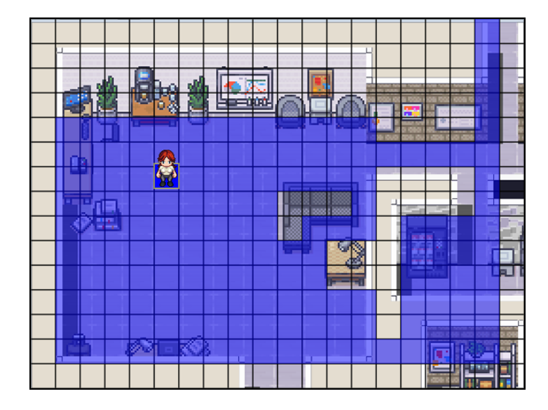

# Agent-Dynamic-Logic-Framework 🦾


#### 核心理念
这个框架通过创建一个可交互、有物理规则、且时间会流逝的 **“虚拟世界”**，来测试LLM的逻辑推理、规划、记忆和决策能力。LLM将作为这个世界中的 **“代理”**，接收环境信息，并做出行动决策以完成特定任务。

- 逻辑推理
- 规划
- 记忆和决策能力

## 安装
```
https://github.com/zideajang/Agent-Dynamic-Logic-Framework.git
```
```
cd Agent-Dynamic-Logic-Framework
```

- 安装构建工具 [rollupjs](https://rollupjs.org/)

```
npm install rollup --save-dev
```
```
npm run build
```

## Demo 👩🏻‍🦰 密室逃生(更新中)
### 准备工作
- 安装 [ollama](https://ollama.com/)
- 安装构建工具 [rollupjs](https://rollupjs.org/)

<div align="center">

</div>


## 人物设定

创建人物素材资源
[Universal-LPC-Spritesheet-Character-Generator](https://liberatedpixelcup.github.io/Universal-LPC-Spritesheet-Character-Generator/#?body=Body_color_light&head=Human_male_light)


好的，这是一个基于模拟来测试LLM（大型语言模型）逻辑能力的框架设计，它将你提出的“有趣、可视化、时空、自由移动空间”等概念融入其中。


<div align="center">

</div>

## 环境的设置
### Grid World
- ROW(网格行数) 
- COL(网格列数)
- TILE_SIZE(网格单元大小)
- collisionData(碰撞设置) 这里 1 表示可行驶区域、0 表示障碍物
### Item(物品)
- itemData ({x:,y:,value}) 位置信息

### Actor
- 控制能力，行动能力、语言能力、决策能力
- speed 
- maxFrame
### 


### World Manager
- Agent和Agent 之间交互
- Agent和环境之间交互
- Agent和Item之间交互

### Event Manager


